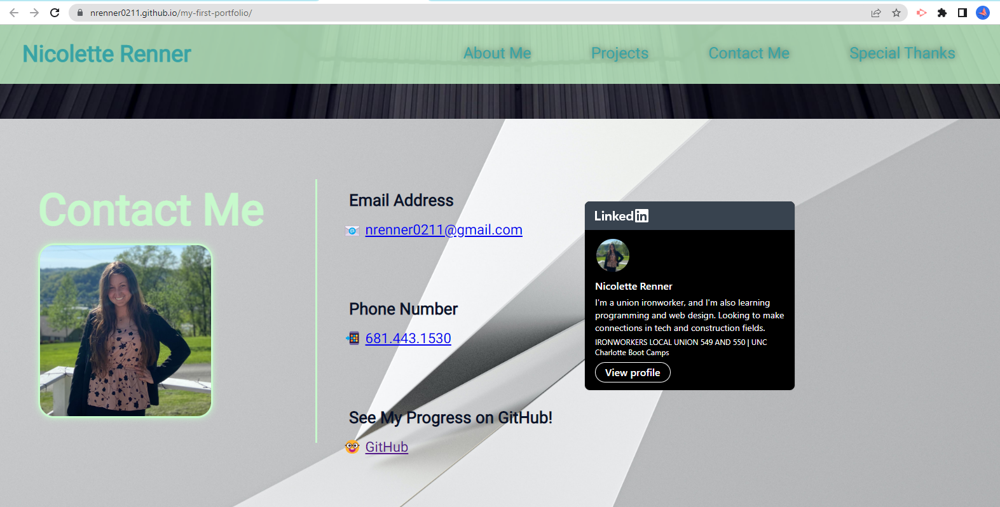

# Hi! Thanks for looking at my first portfolio

## My Name

My name is Nicolette (Niki) Renner. I am attending UNC-Charlotte's full stack Coding Bootcamp, and loving it so far!

## About My Project

The purpose of this project was to showcase the work I'd done so far, and learn more in the process.
This was the first portfolio that I coded from scratch. It's not perfect, but I'm pleased with how it turned out!

## Built With

* HTML
* CSS

## What I Learned

I learned I need to work on my time management, and not spend so much time messing with little details. (Sometimes) &#128517;

## Deployed Website

I used GitHub Pages to deploy this website.
<https://nrenner0211.github.io/my-first-portfolio/>

## Thank You
